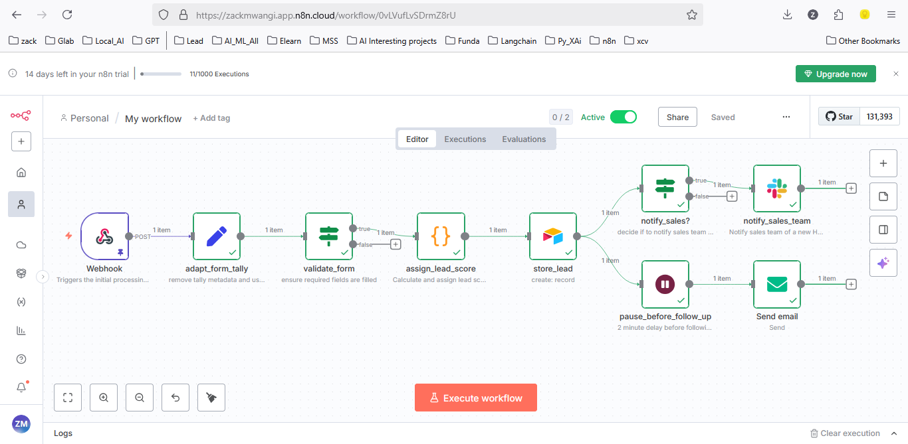
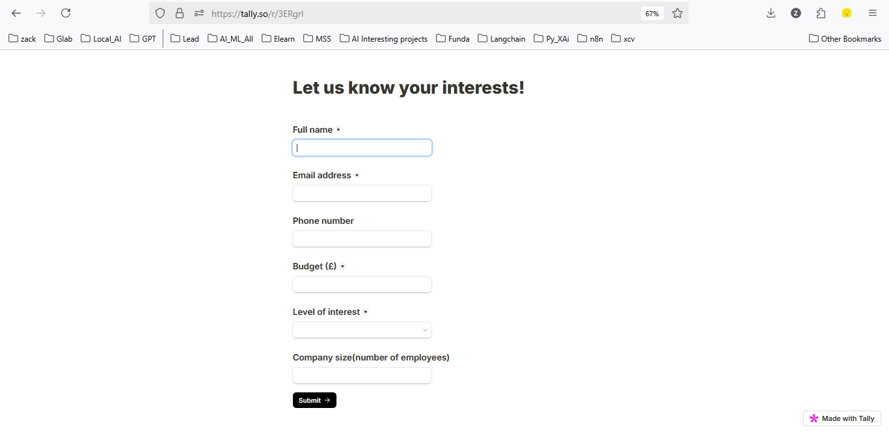
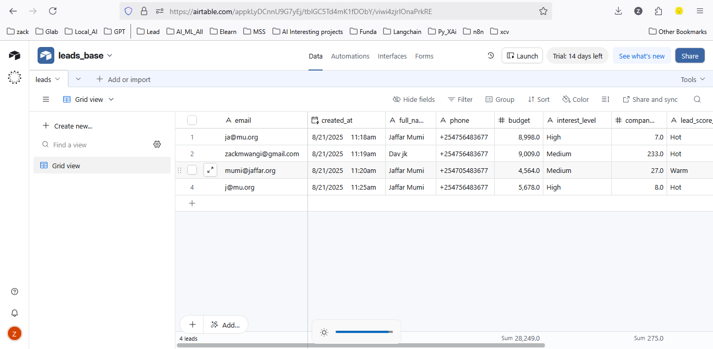
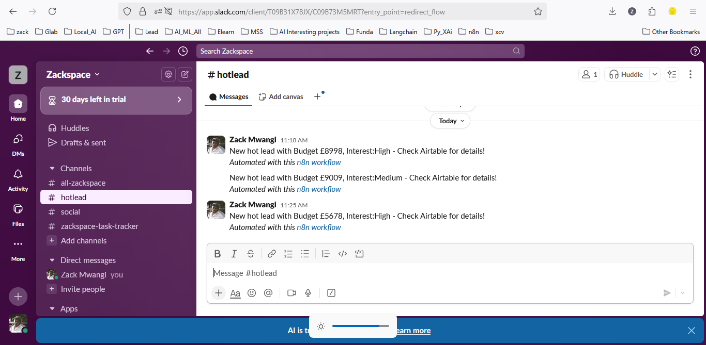

# Project Name: N8N Lead classifier workflow
## Description: Automated n8n workflow that accepts incoming leads from a contact form and classifies them as Hot, Medium or cold. I then stores them in an online spreadsheet(Airtable), Notifies the slaes team via Slack for Hot leads and also follows up via Email with the lead.

## Project by: Zack Mwangi - [zackmwangi@gmail.com]
## Tools: n8n cloud, airtable, tally.so, Slack, Email

---
### Project Flow
- 1: The workflow is triggered by a user submitting a form built with tally.so
- 2: The submitted form data is sanitized to remove metadata from tally.so
- 3: A lead score is calculated and assigned, based on the scoring logic below:
- 4: The lead is then stored in an Airtable table.
- 5: If the lead is classified as "Hot", a Slack notification is sent to the sales team channel
- 6: After a 2 min delay, a follow-up email is sent to the lead to keep them warm.
---
#### Project source
The project source code is available in json format here [./workflow_json/lead_processor_workflow.json](./workflow_json/lead_processor_workflow.json)

#### Screenshots
###  Main workflow on n8n
---
###  Trigger form - Tally
---
###  (Airtable Storage)
---
###  (Slack notification)

---
### Scoring logic
Scoric logic is driven by the budget amount and interest level expressed on the form.

 - Initial score is 0 points

 - A higher budget scores "hotter"
    - £1-£1999 - Cold (+10 points)
    - £2000- £4999 - Warm (+35 points)
    - £5000+ - Hot (+60 points)

 - A higher level of interest scores "hotter"
    - High interest - (+35)
    - Medium interest - (+20)
    - Low interest - (+6)

 The final score range is:
 - 0-49 points -> Cold
 - 50-79 points -> Warm
 - 80-100 points -> Hot

  Examples:

  - 1: £5200 budget with high interest = 60+35 = 95 points -> Hot
  - 2: £4000 budget with medium interest = 35+20 = 55 points -> Warm

### Assumptions, Limitations and future improvements
- We can accomodate and adapt the workflow logic for more data sources, such as typeform, etc
- The scoring logic can be expanded to factor in the company/org size
- We can introduce a voice-based follow-up when a phone number is submitted on the form
- We can clean up the logic to make it more robust in input validation, add nore data stores, etc.

### Conclusion
This workflow provides a simple, working and highly adaptable automation that saves lots of time that would be used hopping across tools. It can be further expanded or customized as required.